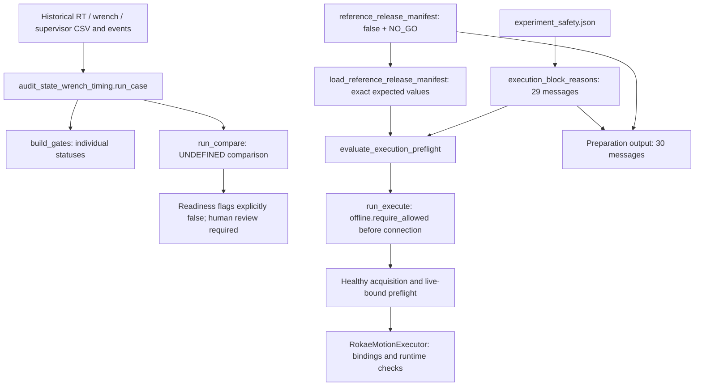

# SAFETY_GATE_ROOT_BLOCKER_ANALYSIS_V1

结论：当前 30 项是 **29 项安全配置检查 + 1 项准备脚本发布检查**，并非完整 live preflight。按证据依赖归为 8 个根问题组，覆盖 24 条直接要求；另有 6 条派生审核要求。其中 11 条限值/空间要求未定义，没有可证明过期的 blocker。SDK 可靠性另列为第 9 个放行重评估问题，不能把它误算成这 30 条配置消息的共同原因。

最关键的代码事实：参考发布加载器固定要求 `false / NO_GO`，诊断与发布之间不存在自动汇总更新链。修复 SDK 或重新生成报告均不会自动解除发布门禁。下一步可以完全离线开展；真实故障闭环需要后续静止机器人验证，不需要立即运动。以下逐项保留英文消息、代码位置、依赖与证据要求，避免与代码标识产生歧义。

Date: 2026-09-26. Analysis only, against the current working tree. No robot connection, implementation fix, threshold edit, release regeneration, or Git commit.

## 1. Current state and exact counting scope

**CURRENT_REFERENCE_RELEASE = NO_GO. TOTAL_BLOCKERS = 30.**

Re-evaluating `ExperimentSafetyConfig.execution_block_reasons()` produces **29** messages. Applying the existing preparation script's additional check of `approved_for_first_robot_trial` produces one more message. These **30 messages match the preparation manifest exactly, including order**. All seven source hashes recorded in that manifest still match current files.

Correction to the earlier shorthand: this is **not a complete live preflight result**. `scripts/prepare_real_dummy_leg_validation.py:main` did not call `evaluate_execution_preflight`, construct a live adapter, or supply an anchor/logger/runtime context. Additional frame, anchor, trajectory, current robot state, and logger gates exist, but were not evaluated for this preparation. Do not invent additional emitted messages or claim that a full preflight has only 30 blockers.

Counting conventions:

- **8 root groups R1-R8**, covering **24 direct requirement messages**.
- **6 derived review-obligation messages**: B01, B24, B25, B26, B28, B29.
- **11 undefined numeric/spatial requirements**: B02-B12, included in the 30.
- **0 demonstrably stale messages; 0 exact duplicate messages**.
- **R9 is an additional unresolved SDK/acquisition evidence problem**, not a direct input to these 30 messages. A complete release reassessment must address R1-R9 (9 work domains).

Root-group count and message count have different units: 8 + 6 is not intended to equal 30; 24 + 6 = 30. A shared root group does not make any individual requirement removable. Review flags are independent checks in code: their evidence dependencies do not mean they automatically change when fields are populated.

## 2. Actual diagnostic, release, and authorization flow



There is **no automatic edge from diagnostic gate results to the reference manifest**. In `scripts/audit_state_wrench_timing.py`, both `run_case` and `run_compare` explicitly write `SAFE_TO_PROCEED_MANUAL_PUSH=False` and `READY_FOR_FIRST_MOTION_TEST=False`. They do not compute release approval using all gates passing.

`lower_limb_sim/reference_release.py:load_reference_release_manifest` (approximately lines 173-198) explicitly expects `approved_for_first_robot_trial=False` and `robot_execution_status="NO_GO"`. A JSON-only change to GO is rejected as an invalid manifest value. This is a frozen process/release constraint, not a computed consequence of SDK 263. Regenerating an artifact under the same loader does not provide a legitimate upgrade path.

`control/execution_preflight.py:evaluate_execution_preflight` (approximately lines 529-535) reads the approval bit and emits **reference_release_not_approved_for_first_robot_trial**. The preparation script instead emits **reference_release_not_robot_approved** (B30); do not conflate the exact spellings. The relative-trajectory builder also incorporates release approval in its audit.

`scripts/run_rehab_experiment.py:run_execute` loads the anchor/frame/safety/reference, builds the trajectory, evaluates the offline request, and calls `offline.require_allowed()` **before adapter construction**. Only after that can acquisition, live preflight, and executor binding checks run. `RokaeMotionExecutor.execute` requires live trajectory and safety bindings and performs additional runtime checks.

Therefore the **direct implementation cause of reference NO_GO is the independent frozen release policy**. The broader evidence contains actual hardware failures, missing configuration/reviews, and undefined criteria. These must inform a future reviewed release process, but no current code automatically converts their aggregate into GO/NO_GO. This task does not modify that policy.

## 3. Complete emitted blocker inventory

Source abbreviations:

- **S**: `safety/experiment_safety.py:ExperimentSafetyConfig.execution_block_reasons`, approximately lines 307-340; input **C**: `config/experiment_safety.json`.
- **P**: `scripts/prepare_real_dummy_leg_validation.py:main`, approximately lines 17-21; input **M**: `reference_release/reference_release_manifest.json`.
- **derived**: an evidence/review dependency, not automatic boolean derivation in code.

| blocker / exact message | source / gate; direct condition; input | category | root/derived | upstream cause | evidence needed | required action | motion required? |
|---|---|---|---|---|---|---|---|
| B01 `experiment_safety_not_reviewed` | S; C.reviewed == false | DOWNSTREAM_DEPENDENCY | derived | R1-R7 evidence missing | Complete site safety and specialized reviews with accountable approval | OFFLINE_CONFIG_COMPLETION after evidence review | No motion for this requirement; stationary access where stated |
| B02 `max_tcp_speed_m_s_not_configured` | S; C.max_tcp_speed_m_s is None | UNDEFINED_REQUIREMENT | root member R1 | Independent missing input/review; not automatically caused by SDK failure | Reviewed risk, stopping, geometry and timing/error budgets; historical maxima are not limits | SCIENTIFIC_THRESHOLD_REQUIRED + EXTERNAL_INFORMATION_REQUIRED | No motion for this requirement; stationary access where stated |
| B03 `max_tcp_acceleration_m_s2_not_configured` | S; C.max_tcp_acceleration_m_s2 is None | UNDEFINED_REQUIREMENT | root member R1 | Independent missing input/review; not automatically caused by SDK failure | Reviewed risk, stopping, geometry and timing/error budgets; historical maxima are not limits | SCIENTIFIC_THRESHOLD_REQUIRED + EXTERNAL_INFORMATION_REQUIRED | No motion for this requirement; stationary access where stated |
| B04 `max_start_anchor_position_error_m_not_configured` | S; C.max_start_anchor_position_error_m is None | UNDEFINED_REQUIREMENT | root member R1 | Independent missing input/review; not automatically caused by SDK failure | Reviewed risk, stopping, geometry and timing/error budgets; historical maxima are not limits | SCIENTIFIC_THRESHOLD_REQUIRED + EXTERNAL_INFORMATION_REQUIRED | No motion for this requirement; stationary access where stated |
| B05 `max_start_anchor_orientation_error_rad_not_configured` | S; C.max_start_anchor_orientation_error_rad is None | UNDEFINED_REQUIREMENT | root member R1 | Independent missing input/review; not automatically caused by SDK failure | Reviewed risk, stopping, geometry and timing/error budgets; historical maxima are not limits | SCIENTIFIC_THRESHOLD_REQUIRED + EXTERNAL_INFORMATION_REQUIRED | No motion for this requirement; stationary access where stated |
| B06 `max_command_lateness_s_not_configured` | S; C.max_command_lateness_s is None | UNDEFINED_REQUIREMENT | root member R1 | Independent missing input/review; not automatically caused by SDK failure | Reviewed risk, stopping, geometry and timing/error budgets; historical maxima are not limits | SCIENTIFIC_THRESHOLD_REQUIRED + EXTERNAL_INFORMATION_REQUIRED | No motion for this requirement; stationary access where stated |
| B07 `max_force_n_not_configured` | S; C.max_force_n is None | UNDEFINED_REQUIREMENT | root member R1 | Independent missing input/review; not automatically caused by SDK failure | Reviewed risk, stopping, geometry and timing/error budgets; historical maxima are not limits | SCIENTIFIC_THRESHOLD_REQUIRED + EXTERNAL_INFORMATION_REQUIRED | No motion for this requirement; stationary access where stated |
| B08 `max_torque_nm_not_configured` | S; C.max_torque_nm is None | UNDEFINED_REQUIREMENT | root member R1 | Independent missing input/review; not automatically caused by SDK failure | Reviewed risk, stopping, geometry and timing/error budgets; historical maxima are not limits | SCIENTIFIC_THRESHOLD_REQUIRED + EXTERNAL_INFORMATION_REQUIRED | No motion for this requirement; stationary access where stated |
| B09 `max_state_age_s_not_configured` | S; C.max_state_age_s is None | UNDEFINED_REQUIREMENT | root member R1 | Independent missing input/review; not automatically caused by SDK failure | Reviewed risk, stopping, geometry and timing/error budgets; historical maxima are not limits | SCIENTIFIC_THRESHOLD_REQUIRED + EXTERNAL_INFORMATION_REQUIRED | No motion for this requirement; stationary access where stated |
| B10 `max_wrench_age_s_not_configured` | S; C.max_wrench_age_s is None | UNDEFINED_REQUIREMENT | root member R1 | Independent missing input/review; not automatically caused by SDK failure | Reviewed risk, stopping, geometry and timing/error budgets; historical maxima are not limits | SCIENTIFIC_THRESHOLD_REQUIRED + EXTERNAL_INFORMATION_REQUIRED | No motion for this requirement; stationary access where stated |
| B11 `max_state_wrench_skew_s_not_configured` | S; C.max_state_wrench_skew_s is None | UNDEFINED_REQUIREMENT | root member R1 | Independent missing input/review; not automatically caused by SDK failure | Reviewed risk, stopping, geometry and timing/error budgets; historical maxima are not limits | SCIENTIFIC_THRESHOLD_REQUIRED + EXTERNAL_INFORMATION_REQUIRED | No motion for this requirement; stationary access where stated |
| B12 `workspace_bounds_not_configured` | S; C.workspace_min_base_m and workspace_max_base_m are null; either missing blocks | UNDEFINED_REQUIREMENT | root member R1 | Independent missing input/review; not automatically caused by SDK failure | Reviewed risk, stopping, geometry and timing/error budgets; historical maxima are not limits | SCIENTIFIC_THRESHOLD_REQUIRED + EXTERNAL_INFORMATION_REQUIRED | No motion for this requirement; stationary access where stated |
| B13 `expected_robot_model_not_configured` | S; C.expected_robot_model is None | MISSING_EVIDENCE | root member R2 | Independent missing input/review; not automatically caused by SDK failure | Current robotInfo identity bound to reviewed model, serial and controller version | STATIONARY_ROBOT_TEST_REQUIRED + OFFLINE_CONFIG_COMPLETION | No motion for this requirement; stationary access where stated |
| B14 `expected_robot_serial_number_not_configured` | S; C.expected_robot_serial_number is None | MISSING_EVIDENCE | root member R2 | Independent missing input/review; not automatically caused by SDK failure | Current robotInfo identity bound to reviewed model, serial and controller version | STATIONARY_ROBOT_TEST_REQUIRED + OFFLINE_CONFIG_COMPLETION | No motion for this requirement; stationary access where stated |
| B15 `expected_controller_version_not_configured` | S; C.expected_controller_version is None | MISSING_EVIDENCE | root member R2 | Independent missing input/review; not automatically caused by SDK failure | Current robotInfo identity bound to reviewed model, serial and controller version | STATIONARY_ROBOT_TEST_REQUIRED + OFFLINE_CONFIG_COMPLETION | No motion for this requirement; stationary access where stated |
| B16 `reviewed_tool_name_not_configured` | S; C.reviewed_tool_name is None | MISSING_EVIDENCE | root member R3 | Independent missing input/review; not automatically caused by SDK failure | Actual tool/workpiece/TCP and fixed assembly/frame records | STATIONARY_ROBOT_TEST_REQUIRED + OFFLINE_CONFIG_COMPLETION | No motion for this requirement; stationary access where stated |
| B17 `reviewed_workpiece_name_not_configured` | S; C.reviewed_workpiece_name is None | MISSING_EVIDENCE | root member R3 | Independent missing input/review; not automatically caused by SDK failure | Actual tool/workpiece/TCP and fixed assembly/frame records | STATIONARY_ROBOT_TEST_REQUIRED + OFFLINE_CONFIG_COMPLETION | No motion for this requirement; stationary access where stated |
| B18 `reviewed_payload_mass_kg_not_configured` | S; C.reviewed_payload_mass_kg is None | MISSING_EVIDENCE | root member R4 | Independent missing input/review; not automatically caused by SDK failure | Measured or vendor-supported mass, CoG and inertia, matched to current SDK configuration | EXTERNAL_INFORMATION_REQUIRED + OFFLINE_CONFIG_COMPLETION | No motion for this requirement; stationary access where stated |
| B19 `reviewed_payload_cog_m_not_configured` | S; C.reviewed_payload_cog_m is None | MISSING_EVIDENCE | root member R4 | Independent missing input/review; not automatically caused by SDK failure | Measured or vendor-supported mass, CoG and inertia, matched to current SDK configuration | EXTERNAL_INFORMATION_REQUIRED + OFFLINE_CONFIG_COMPLETION | No motion for this requirement; stationary access where stated |
| B20 `reviewed_payload_inertia_kg_m2_not_configured` | S; C.reviewed_payload_inertia_kg_m2 is None | MISSING_EVIDENCE | root member R4 | Independent missing input/review; not automatically caused by SDK failure | Measured or vendor-supported mass, CoG and inertia, matched to current SDK configuration | EXTERNAL_INFORMATION_REQUIRED + OFFLINE_CONFIG_COMPLETION | No motion for this requirement; stationary access where stated |
| B21 `reviewed_joint_soft_limits_rad_not_configured` | S; C.reviewed_joint_soft_limits_rad is None | MISSING_EVIDENCE | root member R5 | Independent missing input/review; not automatically caused by SDK failure | Current six-axis limits, geometry/path and ROM review | STATIONARY_ROBOT_TEST_REQUIRED + OFFLINE_CONFIG_COMPLETION | No motion for this requirement; stationary access where stated |
| B22 `reviewed_rt_filter_hz_not_configured` | S; C.reviewed_rt_filter_hz is None | MISSING_EVIDENCE | root member R6 | Independent missing input/review; not automatically caused by SDK failure | Current filter/network settings, vendor semantics and performance review | EXTERNAL_INFORMATION_REQUIRED + STATIONARY_ROBOT_TEST_REQUIRED | No motion for this requirement; stationary access where stated |
| B23 `reviewed_rt_network_tolerance_percent_not_configured` | S; C.reviewed_rt_network_tolerance_percent is None | MISSING_EVIDENCE | root member R6 | Independent missing input/review; not automatically caused by SDK failure | Current filter/network settings, vendor semantics and performance review | EXTERNAL_INFORMATION_REQUIRED + STATIONARY_ROBOT_TEST_REQUIRED | No motion for this requirement; stationary access where stated |
| B24 `robot_identity_not_reviewed` | S; C.robot_identity_reviewed == false | DOWNSTREAM_DEPENDENCY | derived | R2 evidence missing | Current robotInfo identity bound to reviewed model, serial and controller version | STATIONARY_ROBOT_TEST_REQUIRED + OFFLINE_CONFIG_COMPLETION | No motion for this requirement; stationary access where stated |
| B25 `tool_workpiece_not_reviewed` | S; C.tool_workpiece_reviewed == false | DOWNSTREAM_DEPENDENCY | derived | R3 evidence missing | Actual tool/workpiece/TCP and fixed assembly/frame records | STATIONARY_ROBOT_TEST_REQUIRED + OFFLINE_CONFIG_COMPLETION | No motion for this requirement; stationary access where stated |
| B26 `payload_configuration_not_reviewed` | S; C.payload_configuration_reviewed == false | DOWNSTREAM_DEPENDENCY | derived | R4 evidence missing | Measured or vendor-supported mass, CoG and inertia, matched to current SDK configuration | EXTERNAL_INFORMATION_REQUIRED + OFFLINE_CONFIG_COMPLETION | No motion for this requirement; stationary access where stated |
| B27 `collision_configuration_not_reviewed` | S; C.collision_configuration_reviewed == false | PROCESS_RELEASE_GATE | root member R7 | Independent missing input/review; not automatically caused by SDK failure | Collision configuration and a verified current protection-state source; clarify historical SDK 259 | EXTERNAL_INFORMATION_REQUIRED + STATIONARY_ROBOT_TEST_REQUIRED | No motion for this requirement; stationary access where stated |
| B28 `joint_soft_limits_not_reviewed` | S; C.joint_soft_limits_reviewed == false | DOWNSTREAM_DEPENDENCY | derived | R5 evidence missing | Current six-axis limits, geometry/path and ROM review | STATIONARY_ROBOT_TEST_REQUIRED + OFFLINE_CONFIG_COMPLETION | No motion for this requirement; stationary access where stated |
| B29 `realtime_configuration_not_reviewed` | S; C.realtime_configuration_reviewed == false | DOWNSTREAM_DEPENDENCY | derived | R6 evidence missing | Current filter/network settings, vendor semantics and performance review | EXTERNAL_INFORMATION_REQUIRED + STATIONARY_ROBOT_TEST_REQUIRED | No motion for this requirement; stationary access where stated |
| B30 `reference_release_not_robot_approved` | P; M.approved_for_first_robot_trial is not True (false) | PROCESS_RELEASE_GATE | root member R8 | Independent missing input/review; not automatically caused by SDK failure | Complete readiness evidence and formally reviewed first-trial release policy | EXTERNAL_INFORMATION_REQUIRED; reviewed release governance | No motion for this requirement; stationary access where stated |

Category counts for B01-B30: UNDEFINED_REQUIREMENT=11; MISSING_EVIDENCE=11; DOWNSTREAM_DEPENDENCY=6; PROCESS_RELEASE_GATE=2; HARD_FAILURE=0; STALE/HISTORICAL_STATE=0; UNKNOWN=0. **Zero HARD_FAILURE entries in this configuration list does not mean zero historical hardware failures.** B27's false review flag does not prove that a collision occurred.

## 4. Root groups and dependency analysis

| root | messages / issue | resolution classification and scope |
|---|---|---|
| R1 | B02-B12: ten scalar limits plus workspace bounds | SCIENTIFIC_THRESHOLD_REQUIRED / EXTERNAL_INFORMATION_REQUIRED. Each limit needs its own justification. |
| R2 | B13-B15; derived B24 | OFFLINE_CONFIG_COMPLETION + STATIONARY_ROBOT_TEST_REQUIRED. Historical identity is not current sign-off. |
| R3 | B16-B17; derived B25 | OFFLINE_CONFIG_COMPLETION + STATIONARY_ROBOT_TEST_REQUIRED. Actual TCP, tool/workpiece and assembly binding. |
| R4 | B18-B20; derived B26 | EXTERNAL_INFORMATION_REQUIRED + OFFLINE_CONFIG_COMPLETION. Actual payload evidence. |
| R5 | B21; derived B28 | STATIONARY_ROBOT_TEST_REQUIRED + OFFLINE_CONFIG_COMPLETION. Joint limits and path/ROM review. |
| R6 | B22-B23; derived B29 | EXTERNAL_INFORMATION_REQUIRED + STATIONARY_ROBOT_TEST_REQUIRED. Actual RT settings and meanings. |
| R7 | B27: collision configuration review | EXTERNAL_INFORMATION_REQUIRED + STATIONARY_ROBOT_TEST_REQUIRED. Historical safety-event query error 259 requires a verified current protection-state source. |
| R8 | B30: frozen release policy | EXTERNAL_INFORMATION_REQUIRED. A later OFFLINE_CODE_FIX may be needed for a formally reviewed release workflow; editing approval bits is not an unblock plan. |
| R9 (additional; outside the 30) | Native wrench blocking/263; production thread isolation; concurrent RT and cleanup evidence | OFFLINE_CODE_FIX + EXTERNAL_INFORMATION_REQUIRED + STATIONARY_ROBOT_TEST_REQUIRED. No architecture redesign or implementation in this task. |

Evidence dependencies:

```text
R2 -> B24
R3 -> B25
R4 -> B26
R5 -> B28
R6 -> B29
R1,R2,R3,R4,R5,R6,R7 -> B01
R1-R7 + R9 + actual assembly/trajectory review -> future R8 release reassessment
R8 -> B30 -> preparation stops
R8 -> differently named formal preflight release blocker -> no motion authorization
```

The historical R9 chain is partly causal and partly observational:

- Long native queries/263 failures cause no new successful wrench samples, increasing age and hung observations.
- The concurrent Test B also has RT hung. **The SDK/controller/session mechanism linking wrench and RT has not been established.** Do not claim a proven direct wrench-to-RT causal edge.
- RT hung causes early termination; incomplete requested duration causes data_integrity FAIL.
- Worker failure to exit/disconnect causes cleanup FAIL.
- Missing final operation state causes operation_state_stability FAIL; it does not prove a non-idle transition.
- None of these historical statuses automatically writes the frozen reference release.

## 5. Native SDK, worker isolation, stale propagation and cleanup

Production path: `RealRobotAcquisition._wrench_loop` -> `RokaeRobotAdapter.read_internal_wrench` -> Windows `get_end_wrench` -> `forceControl().getEndTorque`. In `hardware/windows/rokae_xcore.py:1128-1169`, the call is synchronous under `_wrench_sdk_lock`. The bundled `.pyi:getEndTorque` signature has no timeout/cancellation argument. Query start/end are captured around the call, and `_check_ec` runs after it returns; no completed duration/error record can be fabricated while native code has not returned.

`RealRobotAcquisition` uses state/wrench/alignment threads in the production process. Separate Python locks do not prove native or GIL isolation. `_wrench_loop` catches exceptions into `_wrench_error`, while old successful samples may remain cached. `latest_health` exposes their ages; `valid` with an alive thread and previously valid sample is not a freshness guarantee and does not necessarily surface a later error as invalid. Preflight and `RokaeMotionExecutor._runtime_reasons` separately compare age/skew to configured limits. If Python scheduling is blocked, timely execution of these checks is not established.

`RealRobotAcquisition.stop` joins producers with a bounded wait. If they remain alive it reports `acquisition_threads_did_not_stop` and refuses SDK disconnect while a native query may still be active. That is a recorded cleanup failure, not successful cancellation.

The diagnostic prototype, `scripts/wrench_process_isolation.py:WrenchProcessSupervisor`, uses a separate process and heartbeat/latest-result channels. `_worker_entry` publishes heartbeat before and after queries; `poll` detects excessive heartbeat age. `stop_normally` cannot interrupt native getEndTorque. `terminate` can stop an OS process but cannot establish graceful SDK disconnect or controller-side cleanup. Its thresholds are diagnostic watchdog settings, not approved motion freshness criteria.

Historical Test B, 2026-08-14: requested 900 s at 20 Hz, observed 169.6096996 s; 2701 queries, 3 consecutive unrecovered 263 errors; maximum query latency 10001.1816 ms and wrench age 34765.5455 ms; two wrench hung events and one RT hung event. Both workers failed normal cleanup after approximately 5 s and were forcibly terminated (exitcode=-15, graceful_disconnect_confirmed=false, worker_terminated=true). The raw wrench CSV contains 2701 records, matching the summary.

| question | conclusion |
|---|---|
| A. Still reproducible/unresolved? | UNRESOLVED. Historical real tests reproduce it and no current closure evidence was found. No new hardware run was made, so present-day reproducibility is not claimed. The native SDK internal cause remains unknown. |
| B. Does current architecture isolate native blocking? | Production: NOT_SUPPORTED. Diagnostic process isolation has partial evidence, is not integrated into production, and does not establish reliable complete concurrent operation. |
| C. Can wrench affect RT/state? | Production same-process scheduling effects were historically observed. Separate-process Test B still observed RT hung. Cross-session/controller causality is not established; RT independence cannot be guaranteed. |
| D. Reliable supervisor detection and fail closed? | Diagnostic hung detection is evidenced. W1 counts wrench hung without immediately aborting; it raises on RT hung/exit. Thus detection is not equivalent to proven bounded fail-closed behavior in all failure cases. Production timing under native blocking remains unproven. Static release gates currently prevent motion regardless. |
| E. Graceful termination? | Not in the cited failure run: both workers required forced termination. Success in normal conditions does not close this failure case. |
| F. A specific unresolved-SDK motion gate? | Historical process/cleanup/integrity gates fail and readiness remains false. Production checks health/stale conditions, but B01-B30 do not read an unresolved-SDK record. The release gate blocks motion independently; it is not automatically linked to error 263. |

The 2026-08-13 isolation report is PARTIAL: it demonstrates continued RT/supervisor progress during a limited blocking window and successful forced termination. The later 900 s attempt limits any generalization. Production `_wrench_loop` also lacks the diagnostic prototype's full per-error event output; this is an evidence/observability gap, not permission to suppress errors. No existing exception handling or cleanup behavior was changed.

## 6. FAIL is different from UNDEFINED

The actual historical W1 Test B gates are retained below. They are **supplemental historical gates, not additions to TOTAL_BLOCKERS=30**.

| gate | status | exact reason | direct evidence |
|---|---|---|---|
| data_integrity | FAIL | lossless audit telemetry and requested duration | Requested 900 s incomplete; ring/sequence/event loss counts are zero |
| operation_state_stability | FAIL | operationState must remain idle | before=idle, after=null, no non-idle transition; missing final state |
| process_stability | FAIL | no worker crash or hung event | RT hung=1, wrench hung=2 |
| cleanup | FAIL | graceful worker exit and SDK disconnect | Both normal exits and graceful disconnects unconfirmed |
| rt_source_timing | UNDEFINED | no formal RT source interval threshold exists | No formal interval threshold |
| rt_ipc_freshness | UNDEFINED | max_state_age_s is unset | max_state_age_s=null |
| supervisor_timing | UNDEFINED | max_command_lateness_s is unset | max_command_lateness_s=null |
| wrench_freshness | UNDEFINED | max_wrench_age_s is unset | max_wrench_age_s=null |
| wrench_error_reliability | UNDEFINED | no formal wrench failure/error-263 acceptance threshold exists | No formal acceptance criterion; observed 263 events remain failures |

There are 4 FAIL and 5 UNDEFINED gates, plus an UNDEFINED A-vs-B comparison. State age, wrench age and lateness overlap B09/B10/B06 and are not new independent root requirements. Do not relabel operation_state_stability as PASS because there was no observed transition: its required postcheck is missing.

| undefined quantity | expected by code | historical descriptive evidence | justified threshold source / evidence required |
|---|---|---|---|
| B02 TCP speed | safety config; preflight trajectory audit | Frozen-reference kinematics, not physical stopping validation | THRESHOLD_NOT_YET_JUSTIFIED: vendor capability, assembly hazards, stopping distance |
| B03 TCP acceleration | Same | Reference kinematics | THRESHOLD_NOT_YET_JUSTIFIED: structural/inertial load and tracking error budgets |
| B04 start position error | preflight / executor anchor checks | Anchor infrastructure, no reviewed current assembly bound | THRESHOLD_NOT_YET_JUSTIFIED: calibration accuracy and collision margin |
| B05 start orientation error | Same | No current reviewed allowance | THRESHOLD_NOT_YET_JUSTIFIED: mounting geometry and allowable contact orientation |
| B06 command lateness | executor; W1 build_gates | Test B loop max 54.2967 ms; loop period is not automatically command lateness | THRESHOLD_NOT_YET_JUSTIFIED: deadline semantics and response budget |
| B07 force | preflight / executor | Historical wrench, not current dummy-leg capacity calibration | THRESHOLD_NOT_YET_JUSTIFIED: fixture/robot load limits and wrench semantics |
| B08 torque | Same | Historical wrench | THRESHOLD_NOT_YET_JUSTIFIED: reference point/frame and structural capacity |
| B09 state age | preflight / executor / W1 | Current state age max 724.1383 ms | THRESHOLD_NOT_YET_JUSTIFIED: tolerated state error and response budget |
| B10 wrench age | Same | Wrench age max 34765.5455 ms | THRESHOLD_NOT_YET_JUSTIFIED: force-monitoring loss and stopping budget |
| B11 state-wrench skew | preflight / executor | Host association can be recorded; physical synchronization unverified | THRESHOLD_NOT_YET_JUSTIFIED: synchronization and phase/endpoint error budget |
| B12 workspace bounds | safety / trajectory audit | Current assembly workspace not defined in Base frame | THRESHOLD_NOT_YET_JUSTIFIED: site geometry, obstacles, dummy-leg ROM and swept envelope |
| RT source interval | W1 build_gates always UNDEFINED | Test B P99=8.26648 ms, max=58.9632 ms | THRESHOLD_NOT_YET_JUSTIFIED: sampling/control requirements; no formal configurable criterion implemented |
| Wrench error/263 acceptance | W1 build_gates always UNDEFINED | Three unrecovered errors | THRESHOLD_NOT_YET_JUSTIFIED: fault response and full-duration reliability requirements; never ignore 263 |
| A-vs-B degradation | run_compare always UNDEFINED | P99 deltas available; incomplete B limits comparability | THRESHOLD_NOT_YET_JUSTIFIED: predeclared comparable design and acceptable degradation budget |

No signed, site-specific justification for these missing formal criteria was found in the inspected sources. Historical maxima, sample rates, 150/750 ms watchdog values or descriptive bins are not approval limits. B21 joint limits, B22 filter and B23 network tolerance are missing reviewed configuration facts, not all scientific thresholds. Input range checks (filter [1,1000], tolerance <=100) cannot select safe actual values. Values and reviews must be bound to the physical robot and setup.

## 7. Stale-state and duplicate audit

All 30 messages reproduce from current inputs. Seven preparation provenance hashes remain identical. **No blocker meets the stale criterion** of a changed underlying condition with an obsolete release artifact being the only remaining issue. B30 is actively enforced by the current loader, not merely an old timestamp.

The earlier pre-motion report's unexecuted-test statements describe that specific session; later long tests exist. Treating that old report as the current complete history would be an obsolete interpretation, not proof that any of the 30 blockers is stale. Historical power=on versus later power=off also cannot establish today's robot state. Old source approval flags cannot override the release manifest, whose superseded_source_first_trial_flags_authoritative is false.

B30 and the differently named formal preflight release reason refer to the same approval bit, but the latter was not emitted by this preparation and is not counted twice. No blocker was deleted and no formal artifact was regenerated.

## 8. Minimum dependency-ordered evidence path

1. **Offline evidence specification first.** Scope R9 closure evidence, SDK/controller/session questions, production-versus-diagnostic differences, complete error/cleanup retention, and existing failure cases. Collect R2-R7 vendor/assembly records and R8 release responsibilities in parallel as work domains, without performing robot actions.
2. **Separate authorized offline engineering task for R9.** Address demonstrated production isolation, health/error propagation and cleanup evidence gaps without changing control/motion implementation, gate requirements or safety thresholds. This report does not redesign or implement the solution. Offline fault tests do not resolve a native hardware failure by themselves.
3. **Justify requirements before selecting limits.** R1 and W1 undefined criteria need engineering/scientific error, response and risk budgets. Complete R2-R7 configuration records only from actual evidence. A true flag alone is not evidence. Missing justification remains THRESHOLD_NOT_YET_JUSTIFIED.
4. **Authorized stationary robot access.** Bind current robot/tool/payload/configuration, verify idle and protection-state observability, resolve the collision-query evidence gap, and run the full existing RT-only/concurrent diagnostic duration. Preserve errors, hung/stale intervals, final-state checks and cleanup failures. Reconnection after a blocked session must be a separately reviewed diagnostic step, not automatic fault recovery.
5. **Review complete stationary evidence.** Review R9 reliability/isolation, R7 safety visibility and R1 timing budgets before signing B24/B25/B26/B28/B29 and B01. Any unresolved blocking, missing postcheck or failed cleanup keeps NO_GO. Do not increase stale age/timeouts, drop wrench supervision, suppress 263 or shorten duration to obtain a pass.
6. **Formal R8 release reassessment.** Review the frozen loader policy, first-trial whitelist, trajectory/ROM/anchor and assembly binding. The current implementation cannot legitimately upgrade via an artifact refresh alone. Any future versioned release mechanism change requires independent review and evidence, not a JSON flag flip in this task.
7. **Only then consider separately authorized supervised motion.** First-trial authorization and successful motion validation are different stages. Real execution, tracking, stopping and dynamic force-supervision evidence eventually require ROBOT_MOTION_TEST_REQUIRED. Do not demand unauthorized motion as the prerequisite for its own first-trial authorization. Research contrasts require their own approval; a reference-only whitelist does not authorize Stage C.

Minimum complete reassessment work set: **R1-R9, nine groups**. This is an evidence-completeness grouping, not a claim of nine independent physical faults. The unknown SDK mechanism may split into several causes or explain multiple historical effects. Neither fixing SDK alone nor filling configuration alone is sufficient for GO.

## 9. What can be done under each access level

- **Without robot motion or connection:** source audit, vendor questions, review/config templates, criterion justification, offline fault/cleanup tests and release-governance review. OFFLINE_FIXES_AVAILABLE=true describes future work, not changes implemented here.
- **Stationary robot access:** current identity/assembly/payload/safety observations, native query and concurrent RT full-duration tests, end-state and cleanup evidence. Test B observed failures at power=off/idle; power-on is not a proposed remedy.
- **POWERED_BUT_NO_MOTION_TEST_REQUIRED:** conditional later scope only if vendor evidence establishes that a required protection/RT state cannot be verified otherwise. Not established as necessary for the next step; no automatic power-on.
- **ROBOT_MOTION_TEST_REQUIRED:** eventual authorized first-trial tracking, dynamic monitoring and stopping validation. Not required for the immediate next task.

## 10. Exact next task

`WRENCH_NATIVE_BLOCKING_EVIDENCE_CLOSURE_PLAN_V1`: produce and review an R9 production-path closure and stationary-validation specification. Bind existing raw evidence and versions; state vendor questions; define required proof for native 263/blocking, co-occurring RT failure, health propagation, per-query/error logging, and graceful versus forced cleanup. List each undefined criterion and its needed justification. Retain the existing 900 s W1 requirement. Do not claim PASS without frozen criteria. Do not automatically test hardware, change release/control code, or implement architecture in that planning task. Authorize implementation and stationary tests separately afterward.

## 11. Final status

```text
SAFETY_GATE_ROOT_BLOCKER_ANALYSIS_V1 = COMPLETE_WITH_LIMITATIONS
CURRENT_REFERENCE_RELEASE = NO_GO
TOTAL_BLOCKERS = 30
ROOT_BLOCKERS = 8 [R1,R2,R3,R4,R5,R6,R7,R8] (24 direct messages)
DERIVED_BLOCKERS = 6 [B01,B24,B25,B26,B28,B29]
UNDEFINED_BLOCKERS = 11 [B02..B12]
STALE_BLOCKERS = 0
WRENCH_NATIVE_BLOCKING_STATUS = UNRESOLVED
WRENCH_ISOLATION_STATUS = NOT_SUPPORTED
MINIMUM_ROOT_BLOCKERS_BEFORE_REASSESSMENT = 9 [R1,R2,R3,R4,R5,R6,R7,R8,R9]
OFFLINE_FIXES_AVAILABLE = true
STATIONARY_ROBOT_TEST_REQUIRED = true
MOTION_REQUIRED_FOR_NEXT_STEP = false
CONTROL_CODE_MODIFIED = false
SAFETY_THRESHOLDS_MODIFIED = false
ROBOT_MOTION_EXECUTED = false
```

Limitations: hardware was not retested and today's physical state is unknown. Native SDK internals and cross-session RT causality remain unproven. NOT_SUPPORTED refers to production isolation guarantees and does not erase partial diagnostic prototype evidence. Analysis stops here; no fixes, release regeneration or commit.

## 12. Primary sources and verification

- [Preparation manifest](results/real_dummy_leg_validation_v1/preparation_manifest.json), [preparation script](scripts/prepare_real_dummy_leg_validation.py).
- [Safety gate](safety/experiment_safety.py), [safety configuration](config/experiment_safety.json), [formal preflight](control/execution_preflight.py).
- [Reference manifest](reference_release/reference_release_manifest.json), [strict loader](lower_limb_sim/reference_release.py), [execute entry](scripts/run_rehab_experiment.py), [executor](control/robot_trajectory_executor.py).
- [Production acquisition](collection/real_robot_acquisition.py), [Windows adapter](hardware/windows/rokae_xcore.py), [process prototype](scripts/wrench_process_isolation.py).
- [W1 implementation](scripts/audit_state_wrench_timing.py), [Test B summary](diagnostics/state_wrench_timing_test_b_20260814T092935649185Z_summary.json), [raw wrench CSV](diagnostics/state_wrench_timing_test_b_20260814T092935649185Z_wrench.csv), [comparison](diagnostics/state_wrench_timing_comparison_20260814T093551709145Z.json).
- [Earlier pre-motion evidence](diagnostics/pre_motion_gate_20260813T102557Z.md), [partial isolation evidence](diagnostics/wrench_process_isolation_validation_20260813T113755Z.md).

Verification performed: exact 29+1 message replay without robot imports/connection; seven source-hash comparisons; complete 30-row inventory; 2701 raw wrench records; category arithmetic and report consistency. No production implementation, safety configuration or reference release was altered.
