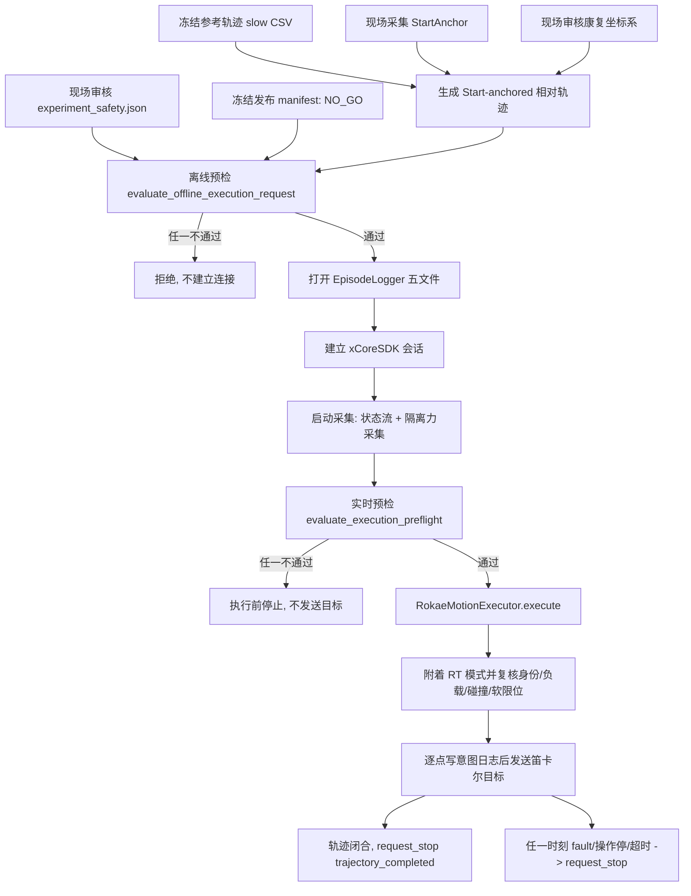

# 机器人运动整条链路

[返回文档索引](README.md) · [机器人操作](ROBOT_OPERATIONS.md) · [真机实验流程](../REAL_ROBOT_EXPERIMENT.md)

这份文档把"从一条冻结参考轨迹，到机器人真的动起来"这条链路上的每一环、
每一道门和当前真实状态写在一处。它同时回答一个具体问题：
**这条链路现在能不能从头走到尾？** 答案是不能，本文逐环给出原因。

> 运动状态仍为 **NO-GO**。本文只描述代码与门禁，不构成任何运动授权。

## 0. 一句话结论

从采集、锚点、轨迹、预检到执行器的代码都已就位，并且每一步都是
**封闭失败**；当前链路在"离线预检"这一步就被冻结发布策略挡住，
即使把安全配置全部填好，也不会自动放行。**没有任何一环可以靠软件自己解开。**

## 1. 链路总览



## 2. 逐环状态与代码位置

| 环节 | 代码位置 | 作用 | 当前状态 | 需要什么才能推进 |
| --- | --- | --- | --- | --- |
| 参考轨迹冻结 | `lower_limb_sim/reference_measured_asymmetric.py`、`reference_release/` | 唯一 first-trial 参考，24 s / 401 点，SHA 固定 | **可用** | 无 |
| 起点锚点 | `control/start_anchor.py` | 现场采集并审核 TCP 位姿、关节、身份、工具 | **未采集** | 现场采集 + 人工审核 |
| 康复坐标系 | `config/rehab_frame_config.json` | 床体 +x/+z 方向 | **全 null / reviewed=false** | 现场测量方向并审核 |
| 相对轨迹生成 | `control/start_anchored_relative_trajectory.py` | 相对锚点生成、闭合、ROM、theta_shank 审计 | **可用** | 依赖锚点与坐标系 |
| 安全配置 | `config/experiment_safety.json` | 速度、加速度、力、位龄、软限位、负载等 | **全 null / reviewed=false** | 现场逐项审核 |
| 发布 manifest | `reference_release/reference_release_manifest.json` | 冻结 `approved_for_first_robot_trial=false` | **NO_GO（硬编码期望）** | 见第 4 节 |
| 离线预检 | `control/execution_preflight.py: evaluate_offline_execution_request` | 连接前一次性静态门禁 | **可用，会拒绝** | 上述全部审核 |
| 采集 | `collection/real_robot_acquisition.py` + 隔离 provider | 状态流 + 力采集五文件 | **已接线** | 现场审核的力配置 |
| 实时预检 | `control/execution_preflight.py: evaluate_execution_preflight` | 绑定实时身份/负载/碰撞/软限位 | **可用，会拒绝** | 碰撞查询须先解决 |
| 执行器 | `control/robot_trajectory_executor.py` | 逐点写意图后发送，统一停止路径 | **可用，但上游未放行** | 上游全部放行 + 现场授权 |
| 调试点动 | `scripts/rokae_commission.py` | 受监督上电/点动/停止 | **需精确确认口令** | 现场操作员 + 明确当次授权 |

## 3. 三道必须同时通过的门

**第一道：离线预检（连接之前）。**
`scripts/run_rehab_experiment.py: run_execute` 在构造任何 adapter 之前先调用
`evaluate_offline_execution_request(...).require_allowed()`。这一步检查
`mode=execute`、`--enable-motion`、精确口令、坐标系/锚点已审核、请求锚点 ID 一致、
发布 manifest 已批准、以及安全配置的全部审核项。**任何一项不通过，进程不会建立
机器人连接，也不会创建 episode 目录。**

**第二道：实时预检（连接之后、发送目标之前）。**
采集健康（状态/力/对齐线程存活、位龄、力龄、skew 在限值内）、运行时身份与锚点和
审核配置三方一致、工具/工件名称被 SDK 报告、负载质量/重心/惯量一致、软限位一致
且当前关节在限位内、碰撞查询有效且无碰撞、机器人确实停在审核锚点、轨迹内容审计
通过。输出与一条实时轨迹、一个安全快照绑定，不能复用。

**第三道：执行器运行时的持续门禁。**
`RokaeMotionExecutor` 在附着 RT 模式后再次复核健康与身份；每发送一个目标前先写意图
日志并再做一次运行时检查；任何故障、超时、操作停都汇入同一个
`request_stop(reason)`；轨迹走完也走同一个停止路径并要求确认正常完成。
软件停止**不能替代**机器人急停、安全控制器和守在急停旁的操作员。

## 4. 为什么现在一定走不到运动

### 4.1 发布 manifest 是冻结的 NO_GO

`lower_limb_sim/reference_release.py: load_reference_release_manifest` 把
`approved_for_first_robot_trial=False` 与 `robot_execution_status="NO_GO"`
写成了**期望值**。也就是说，把 JSON 手动改成 `GO` 会被加载器判为非法，
而不是被接受。这不是可以靠补一个字段绕过的开关，而是一条冻结的发布策略：
诊断结果与发布之间不存在自动汇总更新链。

### 4.2 碰撞状态查询仍是死路

`queryEventInfo(safety)` 在这套 SDK 0.7.0 + 控制器 3.2.1 + XMC12-R1300 上返回
错误码 259。`scripts/audit_rokae_safety_state.py` 的结论是
`BLOCKED WITH EVIDENCE`：调用写法就是文档要求的形式，问题在厂商侧。
`powerState` 和 `operationState` 能读，但不足以替代完整的碰撞状态门禁。
**不得伪造 `collision_state`。**

### 4.3 安全配置与坐标系仍是空模板

`config/experiment_safety.json` 是 schema v3，全部限值为 `null`、
全部 `*_reviewed` 与总 `reviewed` 为 `false`；
`config/rehab_frame_config.json` 的两个方向轴也是 `null`。
这些值必须来自一次有据可查的现场审核，不能照抄仿真或历史最大值。

### 4.4 历史并发故障尚未闭环

20 Hz 力长测出现过 49 次 SDK 263 错误与约 10 s 阻塞；状态+力并发测试在
169.610/900 s 因 `RT worker hung` 终止，最大状态年龄 724.138 ms。
进程隔离已经把风险显式化（父进程不再自行查力），但并发长跑尚未重新通过。

## 5. 现场每道门的操作入口

所有命令都从仓库根目录运行，并且都要求当次的明确授权与守在急停旁的人员。

**观察（不运动）**

```powershell
# 观察型采集用专用入口，它才支持显式的力采集模式。
python -m scripts.acquire_robot_data --ip ROBOT_IP `
  --episode-dir data/SESSION/acquire_001 --duration-s 30 `
  --mode live --wrench-config REVIEWED_WRENCH_JSON --wrench-hz 50 `
  --local-ip REVIEWED_LOCAL_IP
```

**纯离线预览（不连接）**

```powershell
python -m scripts.run_rehab_experiment --mode preview `
  --anchor ANCHOR_JSON --preview-output-dir previews/SESSION
```

**受监督调试动作（口令必须逐字一致）**

```text
python -m scripts.rokae_commission --ip ROBOT_IP --local-ip REVIEWED_LOCAL_IP `
  --confirm "I CONFIRM SUPERVISED COMMISSIONING MOTION" prepare-realtime `
  --network-tolerance-percent REVIEWED_PERCENT
```

**受门控执行（当前一定被拒）**

```powershell
python -m scripts.run_rehab_experiment --mode execute --ip ROBOT_IP `
  --episode-dir data/SESSION/execute_001 --anchor ANCHOR_JSON `
  --anchor-id ANCHOR_ID --enable-motion `
  --operator-confirmation "I CONFIRM SUPERVISED SLOW ROBOT MOTION" `
  --wrench-config REVIEWED_WRENCH_JSON --wrench-hz 50 --local-ip REVIEWED_LOCAL_IP
```

## 6. 本次补齐的接线缺口

在写这份链路时发现并修好了一处真实缺口，属于"封闭失败"而非安全漏洞：

`collection/real_robot_acquisition.py: start` 在 `wrench_provider is None` 且不是
纯状态模式时拒绝连接（2026-09-26 的进程隔离提交引入）。采集入口
`scripts/acquire_robot_data.py` 已按此接上显式 provider，但执行入口
`scripts/run_rehab_experiment.py` 仍然构造 `RealRobotAcquisition(adapter, logger)`，
既没传 provider 也没开纯状态模式。结果是执行路径一旦真的连上机器人，
必然在采集启动时被这道门拒绝，永远走不到实时预检。

现在执行入口要求 `--wrench-config` 与 `--wrench-hz`，并用与采集入口相同的
`build_live_wrench_provider` 构造隔离 provider；配置里的 robot_ip / local_ip
必须与实际连接一致，否则在建立连接前就拒绝。**这道门没有被移除，而是被接线绕过。**

## 7. 状态复现命令

```powershell
# 准备脚本的口径是 30 项 blocker（29 项安全配置 + 1 项发布检查）。
# 该脚本拒绝覆盖已有证据目录，因此只在需要重建准备记录时运行。
python -m scripts.prepare_real_dummy_leg_validation

# 已保存的现行口径（无需重跑即可查看）
python -c "import json;from pathlib import Path;print(len(json.loads(Path('results/real_dummy_leg_validation_v1/preparation_manifest.json').read_text())['safety_block_reasons']))"

# 只读安全状态审计
python -m scripts.audit_rokae_safety_state
```

## 8. 仍然不允许做的事

- 不把本文当作运动授权；本文只描述代码路径。
- 不把 `approved_for_first_robot_trial`、`robot_execution_status` 改成 GO。
- 不把 `experiment_safety.json` 的 `*_reviewed` 或 `reviewed` 改成 `true`。
- 不伪造 `collision_state`。
- 不复制仿真或历史最大值充当审核限值。
- 不在没有明确当次授权、没有操作员守在急停旁时执行上电、复位、使能、
  模式切换、点动或轨迹。
