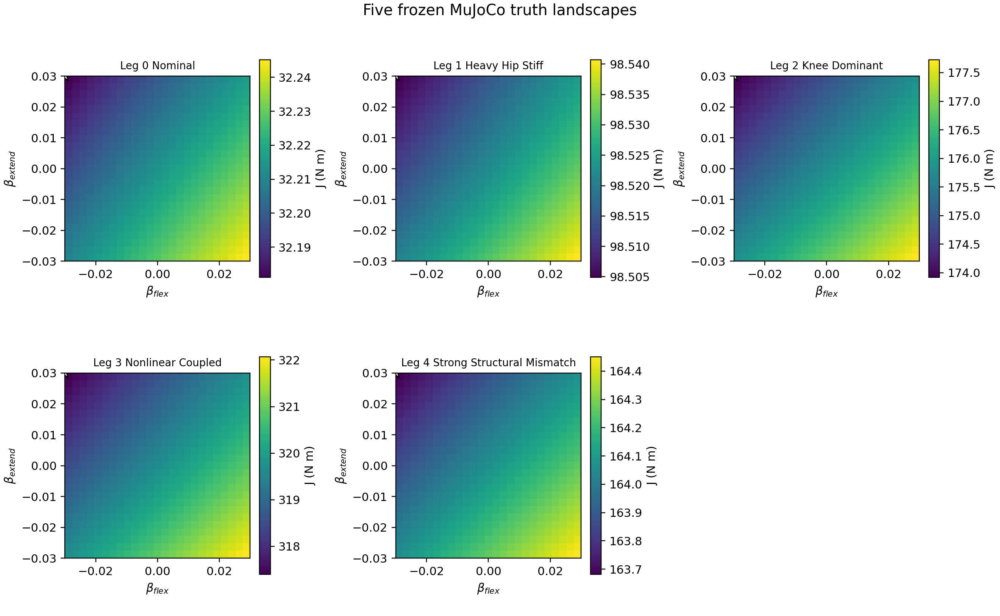
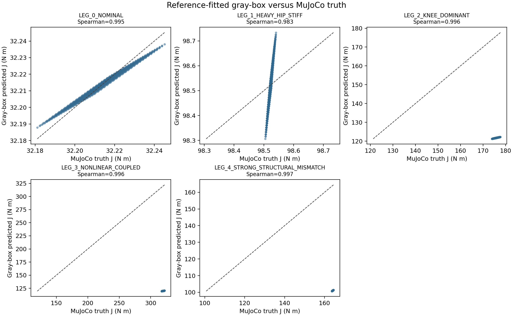
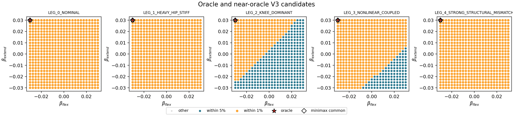

# Five-Leg MuJoCo Mechanical Benchmark V1

## Status and evidence level

`FIVE_LEG_MUJOCO_MECHANICAL_BENCHMARK_V1 = COMPLETE`

`READY_FOR_FROZEN_ALGORITHM_COMPARISON_ON_FIVE_LEG_MUJOCO = false`

`MUJOCO_BENCHMARK_DOES_NOT_SUPPORT_PERSONALIZATION_NECESSITY`

This is a deterministic, offline, synthetic MuJoCo mechanical benchmark. It is
not robot, human, comfort, safety, clinical, or effectiveness evidence. The
five mechanical definitions and synthetic ROMs were frozen before the first
full-landscape run and were not changed after observing the oracle results.

## Model and endpoint

Each MuJoCo model has a fixed pelvis, hip hinge, thigh, knee hinge, shank, and
an equivalent cuff interaction site 0.30 m distal to the knee. The full shank
length is 0.40 m; the cuff distance retains the project's `L2` traction-point
meaning rather than redefining it as full shank length.

The coordinate mapping is:

```text
q_mujoco = [q_hip, -q_knee]
theta_shank = q_hip - q_knee
```

Every 401-sample, 24 s V3 trajectory is replayed with MuJoCo `mj_inverse` at
its prescribed `q`, `dq`, and `ddq`. This exact-state inverse-dynamics mode was
chosen so the endpoint reflects mechanical dynamics instead of controller
instability. Tracking RMS and maximum error are recorded; a candidate exceeding
the frozen threshold is invalid rather than assigned a silent high cost. The
zero tracking errors below are therefore expected by construction and are not
a forward-controller validation result.

The common simulated mechanical endpoint is:

```text
J = sqrt(integral(tau_hip^2 + tau_knee^2) dt / duration), unit N m
```

It is labeled `SIMULATED MECHANICAL ENDPOINT` and is not called comfort or a
subject-preference outcome.

## Table 1. Frozen mechanical parameters and synthetic ROM

All angles are degrees, stiffness is N m/rad, damping is N m s/rad, and cubic
stiffness is N m/rad^3. `kc` and `r` define the elastic coupling displacement
`(q_hip-q0_hip) - r(q_knee-q0_knee)`.

| Leg | Hip ROM | Knee ROM | Mass thigh/shank kg | Inertia thigh/shank kg m2 | Linear k hip/knee | Damping hip/knee | Cubic k3 hip/knee | Coupling kc, r |
|---|---:|---:|---:|---:|---:|---:|---:|---:|
| LEG_0_NOMINAL | 29–112 | 18.5–119.5 | 7.0 / 4.0 | 0.120 / 0.060 | 15 / 12 | 2.0 / 1.5 | 0 / 0 | 0, 0 |
| LEG_1_HEAVY_HIP_STIFF | 35–105 | 20–110 | 10.5 / 3.4 | 0.240 / 0.055 | 32 / 7 | 4.5 / 1.0 | 28 / 4 | 3, 0.5 |
| LEG_2_KNEE_DOMINANT | 22–115 | 32–132 | 6.2 / 5.4 | 0.095 / 0.140 | 6 / 34 | 1.0 / 4.8 | 2 / 32 | 6, 1.4 |
| LEG_3_NONLINEAR_COUPLED | 30–118 | 20–128 | 7.4 / 3.8 | 0.130 / 0.080 | 9 / 10 | 1.8 / 1.8 | 45 / 55 | 18, 0.75 |
| LEG_4_STRONG_STRUCTURAL_MISMATCH | 15–96 | 10–102 | 9.2 / 2.6 | 0.200 / 0.035 | 4 / 22 | 0.6 / 5.5 | 90 / 8 | 28, -0.65 |

These are structural changes, not uniform mass or stiffness multipliers. They
also use different neutral angles, COM locations, and subject-specific ROMs.
They are synthetic stress-test values, not population or clinical ranges.

## Table 2. Full-landscape and oracle characterization

| Leg | Reference J | Oracle beta | Oracle J | Ref-to-oracle improvement | Within 1% | Within 5% | Valid |
|---|---:|---:|---:|---:|---:|---:|---:|
| LEG_0_NOMINAL | 32.213792 | (-0.03, +0.03) | 32.181085 | 0.1015% | 625 | 625 | 625/625 |
| LEG_1_HEAVY_HIP_STIFF | 98.522069 | (-0.03, +0.03) | 98.504889 | 0.0174% | 625 | 625 | 625/625 |
| LEG_2_KNEE_DOMINANT | 175.786283 | (-0.03, +0.03) | 173.915654 | 1.0641% | 272 | 625 | 625/625 |
| LEG_3_NONLINEAR_COUPLED | 319.669231 | (-0.03, +0.03) | 317.396985 | 0.7108% | 500 | 625 | 625/625 |
| LEG_4_STRONG_STRUCTURAL_MISMATCH | 164.067517 | (-0.03, +0.03) | 163.681334 | 0.2354% | 625 | 625 | 625/625 |

All 3,125 trajectories were valid. Every domain preserved its frozen ROM,
duration, endpoint anchors, branch monotonicity, and extrema without clipping.
Maximum tracking error was 0 and repeated reference endpoints were identical.

All five legs naturally selected the same boundary oracle, canonical candidate
`MYOLEG_V3_K0024`. This was observed after the frozen run; it was not a design
target.

## Table 3. Pairwise landscape rank correlations

| Leg A | Leg B | Spearman correlation |
|---|---|---:|
| LEG_0_NOMINAL | LEG_1_HEAVY_HIP_STIFF | 0.999403 |
| LEG_0_NOMINAL | LEG_2_KNEE_DOMINANT | 0.992647 |
| LEG_0_NOMINAL | LEG_3_NONLINEAR_COUPLED | 0.993812 |
| LEG_0_NOMINAL | LEG_4_STRONG_STRUCTURAL_MISMATCH | 0.995108 |
| LEG_1_HEAVY_HIP_STIFF | LEG_2_KNEE_DOMINANT | 0.991982 |
| LEG_1_HEAVY_HIP_STIFF | LEG_3_NONLINEAR_COUPLED | 0.993261 |
| LEG_1_HEAVY_HIP_STIFF | LEG_4_STRONG_STRUCTURAL_MISMATCH | 0.993979 |
| LEG_2_KNEE_DOMINANT | LEG_3_NONLINEAR_COUPLED | 0.999858 |
| LEG_2_KNEE_DOMINANT | LEG_4_STRONG_STRUCTURAL_MISMATCH | 0.999448 |
| LEG_3_NONLINEAR_COUPLED | LEG_4_STRONG_STRUCTURAL_MISMATCH | 0.999596 |

The minimum is 0.991982 and the median is 0.994544. The ordering is therefore
nearly shared despite large absolute load differences.

After normalizing each landscape by its own reference J, the leg-specific
interaction residual has RMS 0.001736 (0.174% of reference) and maximum absolute
value 0.006615 (0.662%). Its variance fraction is 0.470843 because the common
V3 effect is itself extremely small; the normalized landscape matrix remains
99.999699% rank-one in squared singular-value energy. Together with the rank
correlations and near-oracle breadth, this does not constitute a
decision-relevant Subject x trajectory interaction above magnitude scaling.

## Universal candidate analysis

The common minimax candidate is the same `(-0.03,+0.03)` oracle and has exactly
zero regret on every leg. More importantly, the intersection of the five 5%
near-oracle sets contains all 625 candidates; even the intersection of the 1%
sets contains 272 candidates. A universal near-oracle candidate therefore
exists in a very strong sense.

## Table 4. Frozen five-parameter gray-box comparison

For each leg, the unchanged five-effective-parameter subject-specific gray-box
was fitted with exactly one valid observation: the reference candidate J. The
remaining 624 MuJoCo truth values were not available during fitting. They were
used only afterward to evaluate the full predicted landscape.

| Leg | RMSE N m | NRMSE / truth range | Spearman | Predicted beta | True beta | Predicted-best regret | Interpretation |
|---|---:|---:|---:|---:|---:|---:|---|
| LEG_0_NOMINAL | 0.003032 | 0.0473 | 0.995000 | (-0.03,+0.03) | (-0.03,+0.03) | 0 | informative ranking |
| LEG_1_HEAVY_HIP_STIFF | 0.083345 | 2.3278 | 0.982558 | (-0.03,+0.03) | (-0.03,+0.03) | 0 | informative ranking |
| LEG_2_KNEE_DOMINANT | 54.040115 | 14.1927 | 0.995581 | (-0.03,+0.03) | (-0.03,+0.03) | 0 | informative ranking, poor magnitude fit |
| LEG_3_NONLINEAR_COUPLED | 199.578911 | 42.7302 | 0.996185 | (-0.03,+0.03) | (-0.03,+0.03) | 0 | informative ranking, poor magnitude fit |
| LEG_4_STRONG_STRUCTURAL_MISMATCH | 63.008969 | 81.9220 | 0.997402 | (-0.03,+0.03) | (-0.03,+0.03) | 0 | informative ranking, poor magnitude fit |

The large normalized errors partly reflect very narrow within-leg truth ranges,
but the raw errors also show that reference-only magnitude calibration is poor
for the three strongest mismatches. Their fitted parameters reached several
upper bounds. Nevertheless, all five ranking correlations are positive and
high, and all predicted oracles match the true common oracle. No leg is
directionally misleading under the specified Spearman `< 0` definition.

## Required figures

### Figure 1. Five V3 truth landscapes



### Figure 2. Truth versus gray-box prediction



### Figure 3. Oracle and near-oracle candidates



## Answers to the ten required questions

1. **Stable 625 trajectories per leg?** Yes. All five completed 625/625 with
   zero invalid candidates, no clipping, exact-state tracking, and reproducible
   endpoints.
2. **ROMs?** Hip/knee degrees are respectively: 29–112/18.5–119.5,
   35–105/20–110, 22–115/32–132, 30–118/20–128, and 15–96/10–102.
3. **Different oracle beta?** No. All five produced `(-0.03,+0.03)`.
4. **Different ordering despite the same oracle?** Not clearly. Pairwise
   Spearman correlations are 0.991982–0.999858.
5. **Universal near-oracle candidate?** Yes. The common oracle has zero regret
   on all legs, and all 625 candidates are universal within 5%.
6. **Interaction above magnitude scaling?** Small relative shape differences
   exist, but their absolute normalized RMS is only 0.174%; they are not
   decision-relevant compared with the nearly rank-one magnitude structure.
7. **Gray-box ranking correlations?** 0.995000, 0.982558, 0.995581, 0.996185,
   and 0.997402 for Legs 0–4.
8. **Directionally misleading leg?** No. Magnitude calibration can be poor,
   but no ranking correlation is negative and every predicted oracle is correct.
9. **Personalization necessity?** No. This frozen benchmark changes mechanical
   load magnitude but does not create sufficiently distinct V3 optima/orderings.
10. **Ready for frozen algorithm comparison?** No. Running BO variants on these
    landscapes would test recovery of a shared boundary preference rather than
    meaningful leg-specific personalization.

## Validation and stopping decision

The targeted tests cover the five deterministic definitions, structural
parameter differences, subject-specific frozen ROMs, 625-candidate V3 domain,
coordinate geometry, MuJoCo determinism, tracking validity, invalid/no-clipping
semantics, endpoint reproducibility, full 5x625 generation, oracle computation,
gray-box comparison, and required output files.

No Standard BO, Physics BO, adaptive trust, failover, K=4, or K=5 algorithm was
run. Existing personalization implementations were not modified. No PINN,
robot connection, parameter retuning, or automatic commit was performed.
