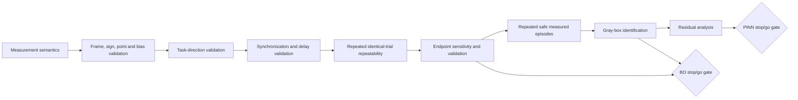

# Readiness Dependency Graph

Current stop is before frame/task-direction validation. The exact next stage is `WRENCH_FRAME_AND_TASK_DIRECTION_RESOLUTION_V1`. It must resolve physical wrench frame/sign/reference-point semantics and validate a task line of action before endpoint repeatability, identification, PINN or BO. This stage does not execute it.
