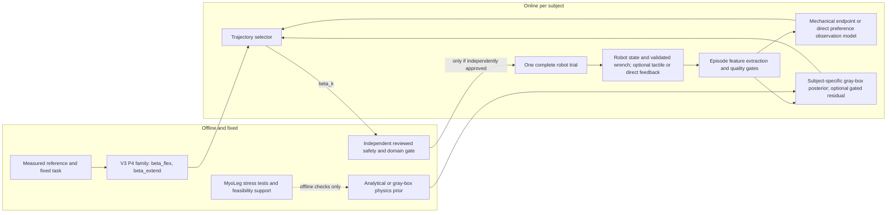

# Future Method Architecture

The diagram is conceptual. It does not authorize robot motion or a human trial.

## State ownership

- Fixed physics prior: analytical/gray-box structure; MyoLeg is offline-only support.
- Subject-specific state: valid episode ledger, effective parameter/posterior state, predictive uncertainty and optional residual state.
- Online selector state: evaluated beta set and mechanical/preference surrogate based only on causal observations.
- Safety layer: independent of the optimizer and unable to be relaxed by predicted reward.

`ALGORITHM_FORMULATION_READY != ROBOT_EXECUTION_READY`.
