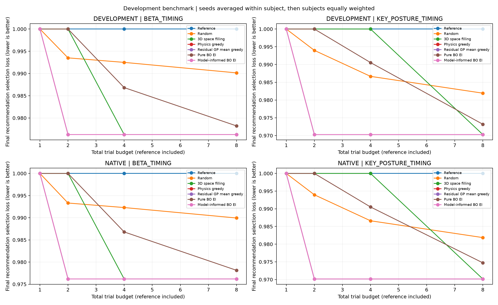
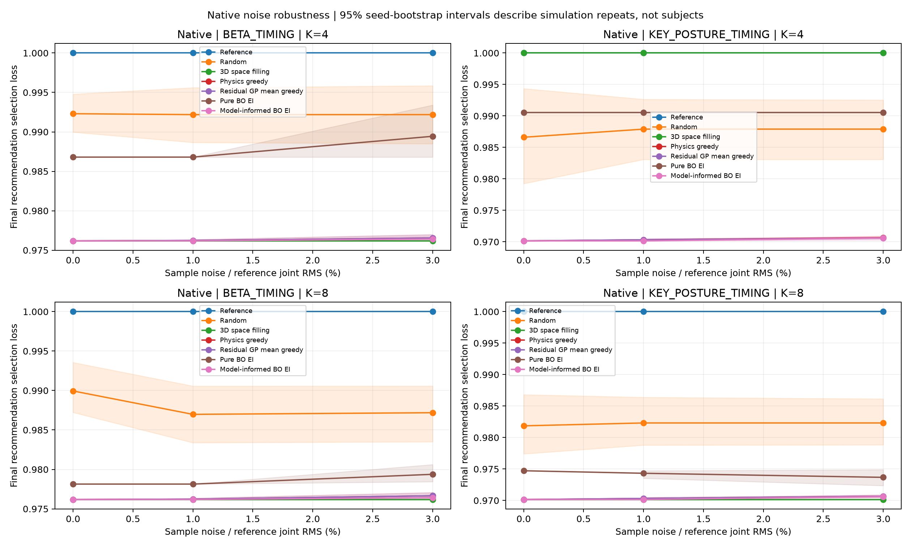

# MyoLeg 开发实验记录

本目录只保存新版本实验的协议、结果与审计。运行方法见 [实验入口](../../lower_limb_sim/myoleg_benchmark/README.md)，研究问题与后续阶段见 [论文计划](../../docs/research/MYOLEG_RESEARCH_AND_PAPER_PLAN.md)。

| 运行 | 状态与用途 |
|---|---|
| [development_20260923_r2 完整报告](development_20260923_r2/REPORT.md) | 已完成290个任务组、830个方法/种子运行、3320条预算结果和6010条实际选点记录；覆盖检查通过，0个任务异常、0个算法运行失败 |
| [development_20260923](development_20260923/RUN_STATUS.md) | 首次运行中断，部分数据保留作工程诊断，不参与完整算法排名 |

本轮设置为 native＋24 个 development 主体、两轨迹族、七算法、K=1/2/4/8；K=4 是主预算，含首次参考。无噪 Random 为5种子，其他确定性方法一次；native 上的1%/3%合成噪声各10个配对种子。8个sealed主体未参与，30种子全队列噪声与公共轨迹对照仍属后续研究。

## 当前开发建议

推荐 **KEY_POSTURE_TIMING＋Physics Greedy** 作为当前工程默认。24个开发主体、无噪、K=4的主体等权E3改善如下；全部最终推荐满足本实验的真实负荷约束。

| 方法 | 关键姿态族改善 | BETA族改善 | 关键姿态族每轮观测超限次数 |
|---|---:|---:|---:|
| Physics Greedy | 2.972% | 2.373% | 0 |
| Residual GP Mean Greedy | 2.972% | 2.373% | 0 |
| Model-Informed BO EI | 2.972% | 2.373% | 0 |
| Pure BO EI | 0.945% | 1.317% | 1 |
| Random（5种子） | 1.333% | 0.750% | 1.2 |
| 3D Space Filling | 0% | 2.373% | 3 |
| Reference | 0% | 0% | 0 |

三种物理方法的最终推荐成绩逐主体相同，因此没有唯一算法赢家。选择Physics Greedy是基于同等推荐质量下实现较简单的开发判断，不是算法运行时间排名。BETA族空间填充也达到相同E3，但K=4每轮有2次观测超限。K=8时，关键姿态族空间填充追平三物理方法，但平均有6次观测超限。

三物理方法在K=2已获得其K=4/8的同一推荐，且24个主体均选出同一候选：关键姿态族`KEY_POSTURE_TIMING:383`（屈/伸姿态偏移均0.12、时间份额偏移−0.10），BETA族`BETA_TIMING:288`（0.12、−0.12、−0.10）。这些是冻结候选参数，不是患者或机器人处方。本轮未观察到残差建模或EI额外的最终推荐收益；完整选点序列并不相同，也不能据此推断所有条件下EI无价值。

Native上1%/3%噪声各10种子均已完成，三物理方法保持接近的成绩。单模型的微小差异不足以替代跨主体稳健性验证。同一候选在开发主体上反复获选，也不支持“个体化必需”的论点；下一步优先做主体外公共轨迹对照，再完成30种子噪声与独立确认。

## 图表与核验

[完整统计报告](development_20260923_r2/REPORT.md) · [执行与数值核验](development_20260923_r2/VERIFICATION.md) · [来源校验清单](development_20260923_r2/analysis_provenance.json)

三物理方法的曲线重叠表示最终推荐成绩相同，不表示后续探索序列相同。

阴影为单一native模型上的种子重复区间，不能解释为患者总体区间。

## 产物规则

每次运行均新建目录。报告器检查完成标志、协议哈希和完整结果身份集合后才发布汇总；成功结束程序和具有完整可分析结果是分别检查的条件。失败运行不得覆盖、拼接或改名成成功运行。

原始 `results.csv` 保留每次推荐的E3、E2、峰值、四项绝对RMS、参考分母、超限与失败记录；`trial_history.csv` 保留实际选点和观测。报告先在主体内汇总种子，再跨主体等权比较。Native重复与主体间统计分开解释。
